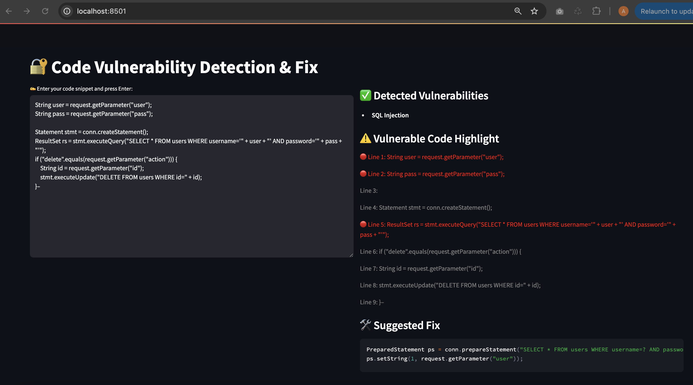

# 🛡️ Code Vulnerability Detection App

This application uses FastAPI (backend) and Streamlit (frontend) to detect and fix code vulnerabilities. It supports Java and C# code snippets.

---

## ✅ Features

- ML-powered multi-label vulnerability detection
- Paste vulnerable code (Java or C#)
- Detect vulnerability types (like SQL Injection, CSRF, etc.)
- Highlight vulnerable lines
- Generate suggested code fixes

---

## ✅ Prerequisites
- Python 3.10 (via Conda)
- Anaconda or Miniconda installed
- Git installed
- codeguard-ai project cloned locally

---

## 📦 Project Structure

```
codeguard-ai/
├── app.py                  # FastAPI backend
├── UI/
│   └── app.py              # Streamlit frontend
├── environment.yml         # Conda environment file
├── scripts/
│   ├── run.sh              # One-click startup
│   └── stop.sh             # Script to stop running services
```

---

## ⚙️ Setup Instructions (Using Conda)

### 1. Clone the Repository

```bash
git clone https://github.com/Infinityavrk/codeguard-ai.git
cd codeguard-ai
```

### 2. Create and Activate Environment

```bash
conda env create -f environment.yml
conda activate vuln-detect-env
```

### 3. Start FastAPI Backend

```bash
uvicorn app:app --reload --port 8000
```

### 4. Start Streamlit UI

Open a new terminal:
```bash
cd UI
conda activate vuln-detect-env
streamlit run app.py --server.port 8501
```

---

## 🚀 (Optional) One-Click Startup: `run.sh`

```bash
chmod +x scripts/run.sh
./scripts/run.sh
```

This script:
- Checks and creates the Conda environment if needed
- Activates it
- Launches FastAPI on `localhost:8000`
- Starts Streamlit on `localhost:8501`

---

## 🛑 (Optional) Stop Running Services: `stop.sh`

```bash
chmod +x scripts/stop.sh
./scripts/stop.sh
```

This script:
- Kills background `uvicorn` (FastAPI) and `streamlit` processes

---

## 🖼️ Application UI

```

```

---

## 🎯 How to Use the App

```
🖊️ Left-hand side: Paste the vulnerable code (Java or C#)

⏎ Press Enter to submit the code

➡️ Right-hand side:
  • ✅ Detected vulnerability types
  • 📍 Vulnerable line numbers
  • 🛠️ Suggested code fix

This makes it easy to understand, identify, and resolve vulnerabilities from our source code in real time.
```

---

## 🧪 Test API

Open your browser:  
📄 Swagger UI: [http://localhost:8000/docs](http://localhost:8000/docs)  
🖥️ Streamlit UI: [http://localhost:8501](http://localhost:8501)

## 📝 Notes

- Ensure the FastAPI backend is active before submitting code.